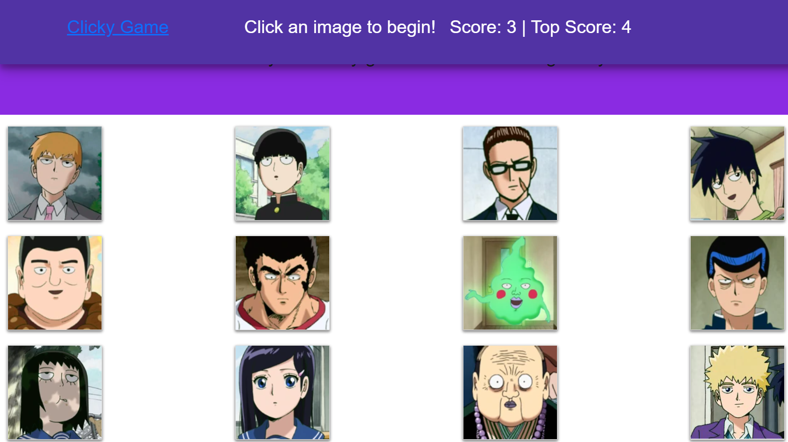

# Memory Clicker

## Description
This is a memory game built using reactjs. It tests the users abilities to remember what images they have seen before and what images they have already selected.

## Built With

* [HTML](https://developer.mozilla.org/en-US/docs/Web/HTML)
* [CSS](https://developer.mozilla.org/en-US/docs/Web/CSS)
* [JS](https://www.javascript.com/)
* [GitHub](https://github.com/)
* [Git](https://git-scm.com/)
* [node.js](https://nodejs.org/en/)
* [npm](https://www.npmjs.com/)
* [express](https://www.npmjs.com/package/express)
* [Heroku](https://dashboard.heroku.com/)
* [Reactjs](https://reactjs.org/)
* [Bootstrap](https://getbootstrap.com/)

## Deployed Link

* [See Live Site](https://rslepejian.github.io/memory-game/)

## Preview of Working Site



## Code Snippet
This code snippet shows how the application detects whether the user clicked on an image they have clicked before or an image they have not clicked before. It then sets the users score, highscore, and updates the message at the top of the screen. 

```javascript
    guessCard = id => {
        if (!(id in guessed)) {
        guessed.push(id);
        jsScore += 1;
        if (jsScore > jsHighscore) {
            jsHighscore = jsScore;
        }
        var sillyArray = [0, 1, 2, 3, 4, 5, 6, 7, 8, 9, 10, 11];
        var sillierArray = [];
        // re order the cards randomly
        for (var i = 0; i < 12; i++) {
            var newRandom = Math.floor(Math.random() * sillyArray.length);
            sillierArray.push(cards[sillyArray[newRandom]]);
            sillyArray.splice(newRandom, 1);
      }
      // Set this.state.cards equal to the newly randomised array
      this.setState({ cards: sillierArray, score: jsScore, highscore: jsHighscore, message: "You guessed correctly!" });
    }
        else {
            guessed = [];
            jsScore = 0;
            // Set this.state.cards equal to the newly randomised array
            this.setState({ cards: cards, score: 0, message: "You guessed incorrectly! Start over!" });
        }
    };
```

## Authors

* **Raffi Lepejian** 

## Contact Information

- [Link to Portfolio Site](https://rslepejian.github.io/updated-portfolio/)
- [Link to Github](https://github.com/rslepejian)
- [Link to LinkedIn](https://linkedin.com/in/raffi-lepejian-071876153)